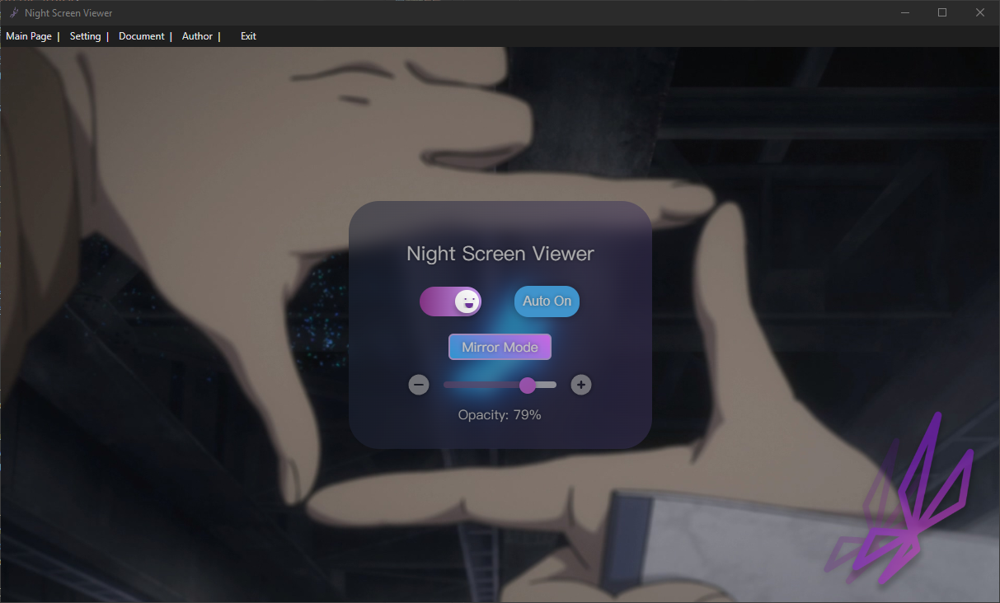

# NightScreenViewer
 
**NightScreenViewer** is a utility designed to enhance the multi-monitor experience by automatically dimming secondary screens when a specific application is running in full-screen mode on the primary monitor. This tool aims to minimize distractions and reduce eye strain during tasks such as gaming, movie watching, or focused work sessions.
     
Users can customize the opacity of the darkening overlay on the secondary screens to suit their preferences. Built for the Windows platform using C#, NightScreenViewer leverages Windows APIs to detect full-screen applications and manage screen overlays efficiently. This project is ideal for users who utilize multiple monitors and seek a seamless and distraction-free viewing experience.  

## Features

- **Automatic Detection**: Automatically detects when a specified application goes into full-screen mode on the primary monitor.
- **Adjustable Opacity**: Users can adjust the opacity of the dark overlay applied to secondary screens to ensure comfort and visibility according to their preferences.

 

## Development Plan

#### *Version - 0.1.7.25.24*
- FrontEnd UIUX √  
- Frame √  

### Next Steps

1. **Phase 1: Setup and Initial Testing**
   - Set up the project repository and basic project structure. √
   - Implement core functionality to detect full-screen applications.
   - Create a basic overlay window that can cover secondary screens.
   - Implement system tray integration for easy access and adjustments. √

2. **Phase 2: Feature Enhancement**
   - Develop the feature to adjust the opacity of the overlay.
   - Implement the functionality to manage a list of applications that will trigger the overlay.
   - Hot-key function.

3. **Phase 3: GUI Development**
   - Design and implement a graphical user interface that allows users to easily configure the application settings.
   

4. **Phase 4: Testing and Documentation**
   - Prepare user documentation and setup guides.

## Installation

Instructions on how to install and configure NightScreenViewer will be provided with the first stable release.

## Planned Features

- Configurable list of applications that trigger the dimming.
- Option to set different opacities for other screens.
- User-friendly GUI for easy configuration of settings.
- Hot-Key to turn on and turn off the feature.
- Animation during the status change.

## Contact

For support, feature requests, or any queries, please open an issue in the GitHub repository issue tracker.

