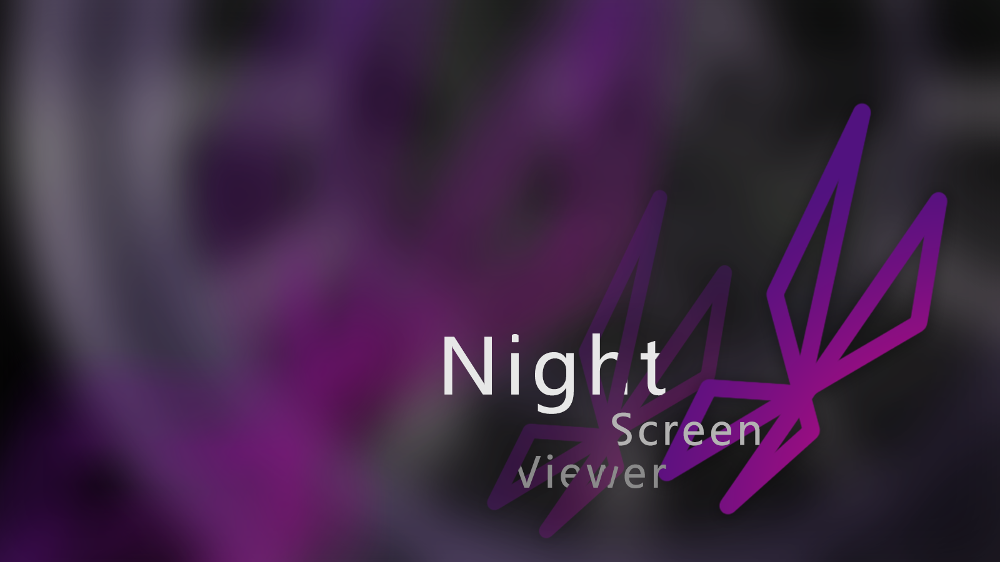

# NightScreenViewer
 
**NightScreenViewer** 是一款旨在提升多显示器体验的工具。当指定的应用程序在主显示器上进入全屏模式时，NightScreenViewer 会自动调暗辅助屏幕。此工具旨在在游戏、观影或专注工作等任务期间，最大限度地减少干扰并减轻眼睛疲劳。

用户可以根据个人喜好自定义辅助屏幕上遮罩的透明度。NightScreenViewer 是为 Windows 平台开发的，使用 JavaScript和C# 编写，利用 Windows API 来检测全屏应用程序并高效管理屏幕遮罩。对于使用多显示器并寻求无缝、无干扰观看体验的用户来说，这是一个理想的项目。

#### **[English Version](README.md)**

## 功能特点

- **自动检测**：自动检测指定应用程序何时在主显示器上进入全屏模式。
- **可调透明度**：用户可以调整应用于辅助屏幕的暗遮罩的透明度，以确保舒适和可见性。
- **手动模式**：用户可以手动打开并关闭和调整暗遮罩。

 

## 开发计划

#### *版本 - 0.1.7.25.24*
- 前端 UIUX √  
- 基础框架创建 √

#### *版本 - 0.1.7.26.24*
- 实现了基础功能，用户可以手动开启和关闭遮罩模式 √
- 开启和关闭以及调整遮罩时的动画效果 √
- 后端代码规整 √
- 前端防抖处理，优化更改不透明度时向后端发送的请求频率 √
- 用户聚焦于其他窗口时，哪怕开启了遮罩也会将用户聚焦的窗体向上调，优化用户使用体验 √
- 后端可以检测当前聚焦的窗口是否位于主屏幕而更新遮罩的窗体是否位于最前端 √

#### *版本 - 0.1.7.27.24*
- 实现了自动检测全屏的功能 √
- 全屏状态下自动启动黑屏模式 √
- 退出全屏或者聚焦的软件不是全屏的时候会退出黑屏模式 √
- 手动关闭或者开启黑屏模式会关闭自动模式防止逻辑冲突 √

### 整体开发

1. **阶段 1：设置和初步测试**
   - 设置项目存储库和基本项目结构。√ 7.25
   - 实现检测全屏应用程序的核心功能。 √ 7.27
   - 创建一个可以覆盖辅助屏幕的基本遮罩窗口。√ 7.26
   - 实现系统托盘集成功能，以便轻松访问和调整。√ 7.25

2. **阶段 2：功能增强**
   - 开发调整遮罩透明度的功能。√ 7.26
   - 实现管理触发遮罩的应用程序列表的功能。
   - 快捷键功能。

3. **阶段 3：GUI 开发**
   - 设计并实现一个图形用户界面，允许用户轻松配置应用程序设置。

4. **阶段 4：测试和文档**
   - 准备用户文档和设置指南。

## 安装

有关如何安装和配置 NightScreenViewer 的说明将在第一个稳定版本发布时提供。

## 计划功能

- 可配置的触发调暗的应用程序列表。
- 为其他屏幕设置不同的透明度选项。
- 用户友好的 GUI，便于配置设置。
- 开启和关闭功能的快捷键。
- 状态变化时的动画效果。

## 联系方式

如需支持、功能请求或任何查询，请在 GitHub 存储库的问题跟踪器中打开一个问题，或者私聊找我。
